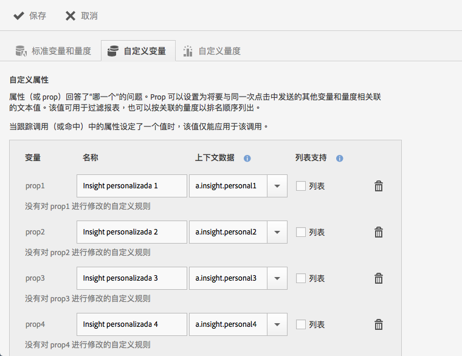
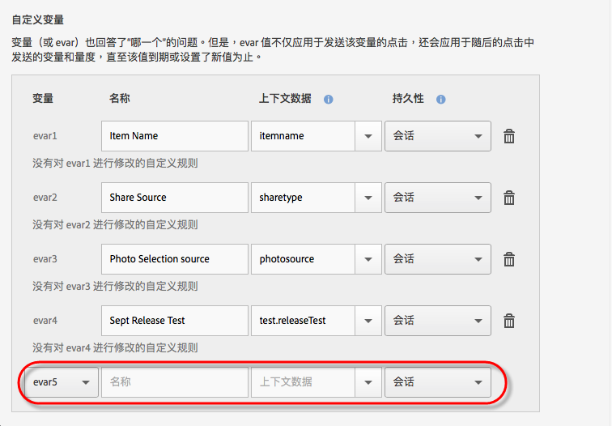

# 管理您的应用程序 {#managing-your-app}

{#eol}

您可以通过配置各种变量和量度来跟踪和管理从应用程序收到的数据。

## 管理变量和量度 {#section_EC2D58AC334F4ED49E764B81C2423A62}

* **标准变量和量度**

   每个应用程序都包含用于跟踪购物车和购买活动的变量和量度。由于有些购买信息无法通过处理规则进行处理，因此 SDK 公开了特殊的 `"&&products"` 上下文数据。例如，您可以包含以下变量：购物车加货、购物车减货、结帐、订单等。上下文数据必须映射到 Adobe Analytics 中的数据。如果该变量填充了一个来自上下文数据的简单映射，则它是映射到此变量的键。如果变量由 Analytics 管理工具中更为复杂的规则填充，则保留为空。

* **自定义变量**

   “自定义变量”页面会显示针对包含您的应用程序数据的报表包配置的所有自定义 Analytics 变量。在此页面中，您可以启用其他变量，并将上下文数据映射到 Analytics 变量。

### 将上下文数据映射到 Analytics 变量

单击&#x200B;**[!UICONTROL 管理应用程序设置]** > **[!UICONTROL 管理变量与量度]** > **[!UICONTROL 自定义变量]**。

这些映射将调用与 [处理规则](https://experienceleague.adobe.com/docs/analytics/admin/admin-tools/processing-rules/processing-rules.html) 在Adobe Analytics中使用。

以下是您可以配置的自定义变量列表：

* **[!UICONTROL 自定义属性]**（或 prop）回答了“哪一个”的问题。Prop 可以设置为，该文本值将与在同一点击中发送的其他变量和度量相关联。这些值可用于筛选报表，也可以按关联量度的排名顺序列出。

   当在跟踪调用（或点击）中设置某个属性的值，该值仅适用于该调用。

* 的 **[!UICONTROL 自定义变量]** （或eVar）还回答了“哪一个”的问题。 但是，eVar值不仅可应用于发送该数据的点击，还可应用于在后续点击中发送的变量和量度，直到该值过期或设置了新值为止。
* **[!UICONTROL 自定义列表变量（或多值变量）]**&#x200B;执行的操作与变量相同，但是列表变量允许在一次点击中捕获多个值。有关更多信息，请参阅 [列表](https://experienceleague.adobe.com/docs/analytics/implementation/vars/page-vars/list.html?lang=zh-Hans) 变量。

以下映射在 Mobile Services 中创建后即会显示在 Analytics 中。

* **[!UICONTROL 名称]**

   数据收集变量的易记名称。

* **[!UICONTROL 上下文数据]**

   如果该变量填充了一个来自上下文数据的简单映射，则它是映射到此变量的键。如果变量由 Analytics 管理工具中更为复杂的规则填充，则将此字段保留为空。

   单击上下文数据列，然后选择要映射的上下文数据变量。下拉列表包含过去 30 天中接收的变量，因此，如果要映射的上下文数据不在列表中，您可以键入该数据。

* **[!UICONTROL 持久性（自定义变量和自定义列表变量）]**

   持久性决定自定义变量 (eVar) 值将过期或不再与其他点击相关联的时间。如果某个 eVar 在点击触发时过期，那么将无值与该 eVar 的点击相关联。这意味着触发点击时，没有 eVar 值处于活动状态。

   您可以选择以下选项之一：

   * **[!UICONTROL 会话]**

      eVar 值将会在 Analytics 访问期间持续存在。

   * **[!UICONTROL 跟踪调用]**

      eVar 值将只在跟踪调用或包含它的点击中持续存在。

   * **[!UICONTROL 永不过期]**

      eVar 值将在所有后续跟踪调用中持续存在。
   * **[!UICONTROL 高级]**

      Adobe Analytics 拥有更高级的 UI 可用于设置 eVar 持久性。如果为 Mobile Services 不支持的 eVar 设置了持久性值，则此值会显示在 Mobile Services UI 中。

      要管理 eVar，请单击 **[!UICONTROL Adobe Analytics 报表包管理器]** > **[!UICONTROL 转化变量 UI]**。

   * **[!UICONTROL 列表支持]**

      支持在一个跟踪调用中传递与该属性关联的多个值。分隔符必须为一个字符，且不能为零或空格。

   * **[!UICONTROL 分隔符]**

      分隔符必须为一个字符，且不能为零或空格。

### 其他 Analytics 变量

您可以使用位于每个变量部分底部的下拉列表来启用其他变量。

选择一个未使用的变量编号并键入名称。您可以选择是否提供要存储的上下文数据变量和任何其他信息。

* **自定义量度**

   量度（或事件）回答了“多少数量？”**&#x200B;或“多少次？”**&#x200B;的问题。事件可能会在用户每次执行某项操作时增加或保持原始数值（例如，价格）。自定义量度包括各种事件，例如创建应用程序、下载或导出 PDF 或 CSV 文件、保存促销活动、下载 SDK、运行报表、添加指向应用商店的链接、激活应用程序内消息等。

   选择以下任一自定义量度类型：

   * **[!UICONTROL 整数]**
   * **[!UICONTROL 小数]**
   * **[!UICONTROL 货币]**

## 管理目标点 {#section_990EF15E4E3B42CC807FCD9BEC8DB4C6}

目标点允许您定义地理位置，将其用于关联、通过应用程序内消息进行定位等。当在某个目标点中发送点击时，该目标点会附加到该点击。有关目标点的更多信息，请参阅[管理目标点](/help/using/location/t-manage-points.md)。

## 管理链接目标 {#section_F722A387E22A430187B063D358A87711}

您可以创建、编辑、存档/取消存档和删除链接目标。随后在生成营销链接、推送通知或应用程序内消息时，这些目标可以在内联调用。有关链接目标的更多信息，请参阅[管理链接目标](/help/using/acquisition-main/c-manage-link-destinations/t-archive-unarchive-link-destinations.md)。

## 管理回发 {#section_78B0A8D7AE6940E78D85AE3AB829E860}

回传允许您将 Adobe Mobile 收集的数据发送至单独的第三方服务器。利用您用来显示应用程序内消息的相同触发器和特征，可以将 Mobile 配置为将自定义数据发送至第三方目标。有关回发的更多信息，请参阅[配置回发](/help/using/c-manage-app-settings/c-mob-confg-app/signals.md)。
