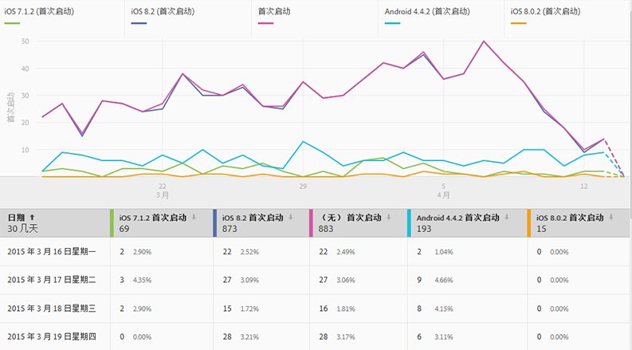
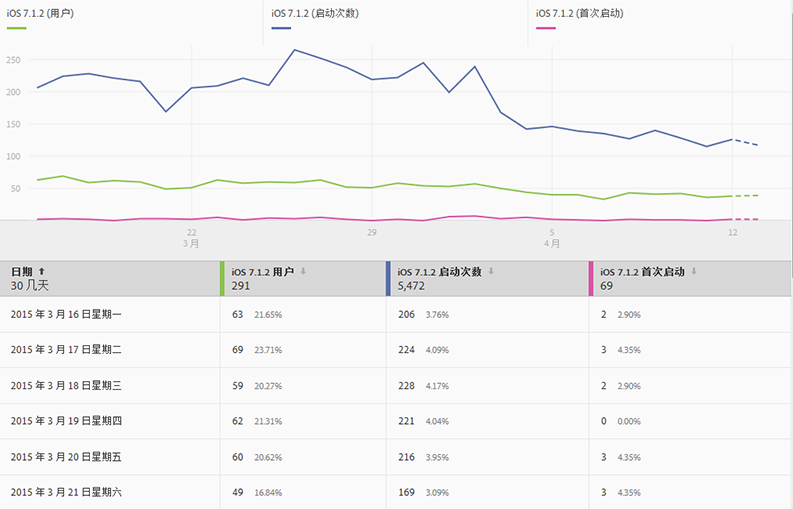

# 报表类型 {#report-types}

在自定义报表时，广泛的灵活性可能会导致产生一些问题，从而难以确定哪种报表类型最适合获取您所需的数据。

在自定义报表之前，您必须了解量度和维度之间的区别。

* 量度

   量度用于测量您的数据。量度是可以计数并累加的值，用于了解特定操作在您的应用程序中发生的频率。常用量度包括安装次数、启动次数、收入、存留期值和登录次数。例如，每当您的应用程序启动时，_ launches_ value增加一个。

* 维度

   维度用于描述您的数据。维度是通过使用字符串表示的，或用作字符串(如邮政编码)的数字，用于组织和分割数据。常见维度示例包括操作系统版本、促销活动名称、产品名称和移动运营商。每个维度都具有一些与其本身相关联的特定值。For example, the OS version dimension has values such as _iOS 7_ and _Android 4.1.2_.

以下是可以在 Mobile UI 中生成的报表类型：

## 特定时段报表 {#section_2741DA54C90C49AFB17C7B9BC7AD627D}

特定时段报表显示量度如何在一段特定的时间范围内执行，这样，您就能够快速识别尖峰和趋势。分析通常在特定时段报表中开始，然后随着您不断深入研究可能会为量度尖峰或趋势做出贡献的因素，分析会转到趋势报表和排名报表中。

例如，如果您在启动次数中看到了一个尖峰，则可以运行趋势报表以显示前 5 个操作系统的启动次数，从而找到哪些操作系统对启动次数中的尖峰贡献最大。

若要查看特定时段报表中的维度值以及其他量度，您可以使用实例量度并定义维度过滤器。

## 趋势报表 {#section_C9BE9A2EDBFF4D938B9AF14C8AA67883}

趋势报表可帮助您了解最受欢迎的维度针对某个量度的绩效。您可以使用此报表来确定哪些维度值对量度变化的贡献最大。

要查看某个维度的趋势报表，请向特定时段报表添加相应的置顶过滤器（例如，操作系统 = iOS 6.0.1），以查看相同的数据。此外，您可以在已过滤的特定时段报表中再额外添加五个量度。

## 已过滤的特定时段报表 {#section_F8FAF2A4496F449CA99EF1E052C71A2D}

如果您需要查看某个特定维度值，则可以向特定时段报表添加一个置顶过滤器。以下报表显示某个特定操作系统版本在 30 天内的启动次数、升级次数和崩溃次数。

## 排名报表 {#section_C073D744A95843AF99EE74FB5B013735}

排名报表显示前 50 个维度为某个量度做出贡献的频率。此报表可用于查看在一段日期范围内跨越大量值所做出的总贡献。

## 环状层次图报表 {#section_17A9842039174DE094A6B1E9837E35BB}

环状层次图报表提供基本报表以及划分等内容。此可视化使用高度来显示量度，以及量度之间的绩效差异。每个同心圆代表其本身对应类别中的一个受众区段。您可以对受众执行操作，例如应用置顶过滤器、隐藏量度和查看量度。

您可以查看产品内的教程，它介绍了如何与环状层次图进行交互。

要启动此教程，请执行以下操作：

1. in Manage App Settings, click **[!UICONTROL Usage]**.

1. Click **[!UICONTROL Technology]** &gt; **[!UICONTROL Technology Breakdown]**.
1. In the title bar of the report, click **[!UICONTROL Customize]**, and click the information icon.

### 路径报表 {#section_AD400106BC684B50B27CCCD3F4497114}

路径报表以路径分析为基础，可显示一个路径图表，以表示在应用程序中从一种状态变为另一状态的路径。

每个节点的形状都类似于框，可表示用户路径通过应用程序时的一种状态。例如，在以上插图中，顶级节点表示启动应用程序然后从图库中选择照片的用户数量。

### 漏斗报表 {#section_AF3B0C899D844FC3AD1F91A2C452C92F}

“漏斗”报表可帮助确定客户在与您的移动设备应用程序进行交互时，在哪里放弃了营销活动或偏离了定义的转化路径。您还可以使用“漏斗”报表来比较不同区段的操作。

通过漏斗视图，您可以发现客户在何处离开流程。监视每个步骤的客户决策可让您了解客户在哪里受到阻碍，他们倾向于遵循哪条路径，以及客户何时离开您的应用程序。

