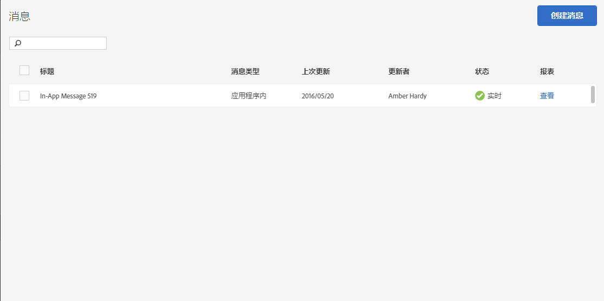

# 管理消息{#manage-messages}

View a list of your in-app and push messages with details about when each message was last updated and whether the messages are live or have been deactivated.

您可以复制、激活/停用和存档/取消存档消息。您还可以查看相关报表，了解已查看消息的用户数量以及已点进消息的用户数量。

要管理消息，请单击 ***your_app_name &gt; Messaging &gt; Manage Messages.***********

以下是有关可在消息中完成的各项任务的更多信息：

* **搜索和过滤消息**

   Use the search box at the top of the list to search for and filter messages. 您在搜索框中键入的任何内容都会显示来自列表中的匹配消息。搜索可在所有表格列中进行。例如，您可以键入`Draft`以仅显示具有此状态的消息。您还可以键入用户的名称以便仅显示由该用户更新的消息。

   In addition to the search box, you can also click any column header to sort the list in ascending or descending order by the contents of that column.

   例如，如果您对&#x200B;**[!UICONTROL 消息类型]列进行升序排序，则您所有的应用程序内消息会在您的推送消息之前显示。**&#x200B;如果您对&#x200B;**[!UICONTROL 上次更新]列进行降序排序，则您最近更新的消息将显示在列表最上方。**

* **复制消息**

   1. Select the check box next to one or more messages and click **[!UICONTROL Duplicate Selected]**.
   1. 选择要为其复制消息的应用程序。
   1. 键入消息名称。

      要为同一个应用程序复制某条消息，请为该消息键入一个新名称：如果保留相同的名称，则会覆盖原始消息。如果您为不同的应用程序复制消息，则可以保留相同的名称，而不会覆盖原始消息。

   1. Click **[!UICONTROL Duplicate]** or **[!UICONTROL Overwrite]**, as necessary.

* **停用或激活消息**

   To deactivate a message, select the checkbox next to at least one active message and click **[!UICONTROL Deactivate Selected]**.

   To activate a dectivated message, select the checkbox next to at least one deactivated message and click **[!UICONTROL Activate Selected]**.

* **存档消息**

   要存档消息并清理消息列表，请执行以下操作：

   >[!TIP]
   >
   >Before you can archive a message, you must deactivate it.

   1. Select the checkbox next to at least one deactivated messages and click **[!UICONTROL Archive Selected]**.

* **查看存档消息**

   1. Click **[!UICONTROL View Archive]**.
   1. Select the checkbox next to at least one archived message and click **[!UICONTROL Unarchive Selected]**.

