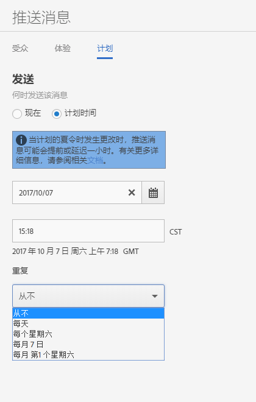

# 计划：推送消息{#schedule-push-message}

在AdobeMobile Services UI中，您可以计划要立即传送的推送消息、稍后传送的推送消息以及重复事件。 这些事件可以按每日、每周或每月计划。

>[!TIP]
>
>用户可以随时修改推送消息作业的计划设置。如果没有适用的日期发送重复的计划邮件，例如，每31天、2月31日或当月第5个星期二发送一个月的重复作业，则不会发送邮件。

请牢记以下信息：

* 正确的日期和时间格式为 `hh:mm` 和 `mm/dd/yyyy`。

* 您可以通过以下方式编辑计划的消息：

   * 将日期更改为将来的日期。
   * 将重复时间间隔更改为另一个时间间隔。

      例如，如果您最初每天都发送一条消息，则可以将循环切换为每周。

## 在计划定期推送消息之前

在计划定期推送消息之前，您&#x200B;**必须**&#x200B;了解以下信息：

* **[!UICONTROL 重复]**&#x200B;下拉列表中显示的选项取决于您键入或选择的日期。

   例如，如果您键入了 `Saturday, October 7`，则会显示以下选项：

   * **[!UICONTROL 从不]**
   * **[!UICONTROL 每天]**
   * **[!UICONTROL 每个星期六]**
   * **[!UICONTROL 每月 7 日]**
   * **[!UICONTROL 每月第 1 个星期六]**

* 推送消息根据格林威治标准时间(GMT)进行预定和发送。

   例如，如果您计划在每周六中午12:00（中午）(太平洋标准时间 ****)发送重复消息，则消息将实际在周六晚上7: **GMT发送**。
* 消息的发送方式取决于您是位于美国、欧洲还是亚洲。

   例如，如果您位于加利福尼亚州圣何塞，并且您计划将于10月31日下午5: ***30*** PST **（太平洋标准时间）发送的消息**，该消息实际发送在11月 ***12:30 GMT*** am 12:30 **GMT** am时。 如果您位于东京，并且计划将在1月1日 ***清晨*** 5:30发送消息，则消息将在12月31 ***日格林尼治时*** 间晚上8:30 **发送**。
* 推送消息的发送时间提前或稍后提前一小时，具体取决于节省日时间。
* 当您查看推送消息报告时，消息将显示在系统的本地时区中。

   例如，如果开始时间为太平洋标准时间 **下午** 12:00，尽管消息将在格林尼治标准时间晚 **7:00发送**，但消息报告将显示发送时间为下午12:00 **PST**。

## 计划定期推送消息 {#section_675BD754E5A04423A1751193698A978F}

1. 在新推送消息的“计划”页面上，选择&#x200B;**[!UICONTROL 已计划]**&#x200B;或&#x200B;**[!UICONTROL 现在]**。

   有关更多信息，请参阅[创建推送消息](/help/using/in-app-messaging/t-create-push-message/t-create-push-message.md)。

   如果您选择&#x200B;**[!UICONTROL 现在]**，则会立即推送消息。要阻止将消息计划为立即发送，请单击&#x200B;**[!UICONTROL 另存为草稿]**。

   

1. 如果您选择了&#x200B;**[!UICONTROL 已计划]**，则请单击日历图标，然后选择或键入开始日期。
1. 键入时间。 
1. 在&#x200B;**[!UICONTROL 重复]**&#x200B;下，选择以下选项之一：

   * **[!UICONTROL 从不]**
   * **[!UICONTROL 每天]**
   * **[!UICONTROL 每个星期二]**
   * **`<Day x>`当月**

      显示的选项会根据您选择或键入的开始日期而发生更改。
   * **`<nth day>`每月**

      显示的值会根据您选择或键入的开始日期而发生更改。

1. 在&#x200B;**[!UICONTROL 结束重复]**&#x200B;中，键入结束日期和时间。
1. 单击以下选项之一：

   * **[!UICONTROL 另存为草稿]**

      此选项会将消息保存为草稿格式。您可以选择此选项来保存未完成的消息，或保存消息以便他人在激活它之前能够编辑或批准该消息。

      如果您在上一步中选择了&#x200B;**[!UICONTROL 现在]**，草稿消息将在激活后被立即发送。如果您选择了推送消息的日期和时间，则会根据此计划推送消息。

   * **[!UICONTROL 保存并计划]**

      此选项在预定的日期和时间发送消息。

要稍后推送草稿消息，请完成以下任务之一：

* 单击&#x200B;**[!UICONTROL 管理消息]**，选中消息旁边的复选框，然后单击&#x200B;**[!UICONTROL 激活选定项]**。
* 单击&#x200B;**[!UICONTROL 保存并发送]**&#x200B;以保存消息并发送它。
