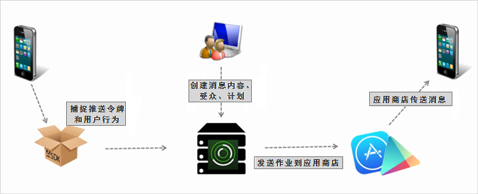

# 创建推送消息 {#create-a-push-message}

您可以通过 Mobile Services UI 将推送消息发送至 Analytics 区段，以便您在与用户接触过程中利用强大的 Analytics 数据。

>[!IMPORTANT]
>
>在创建推送消息之前，请参阅[启用推送消息的先决条件](/help/using/c-manage-app-settings/c-mob-confg-app/configure-push-messaging/prerequisites-push-messaging.md)。

推送消息在选择接收通知的户未主动使用应用程序时向用户显示。这些通知用于提醒用户有新的更新、优惠和提醒。借助这些通知，您可以在一个简化的工作流中创建、测试、管理和报告推送消息。

推送消息由应用商店在服务器端发送，而不是从 Adobe Mobile Services 发送：

要创建推送消息，请执行以下步骤：

1. 单击 ***your_app_name*** > **[!UICONTROL 消息传送]** > **[!UICONTROL 管理消息]** > **[!UICONTROL 创建消息]** > **[!UICONTROL 创建推送消息]**。
1. 配置受众选项。

   有关更多信息，请参阅[受众：为推送消息定义和配置受众区段](/help/using/in-app-messaging/t-create-push-message/c-audience-push-message.md)。
