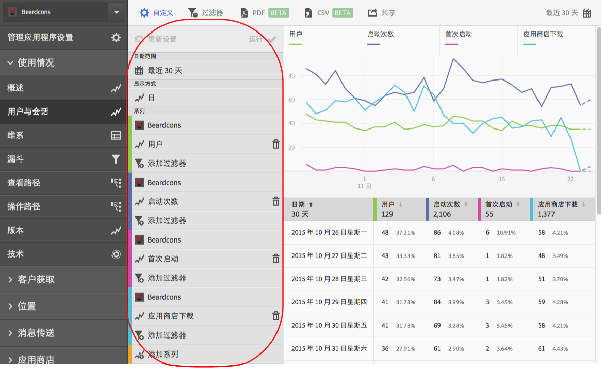

# 将过滤器添加到报表{#add-filters-to-reports}

{#eol}

此信息可帮助您通过添加其他过滤器（区段）来自定义内置报表。

>[!IMPORTANT]
>
>Marketing Reports &amp; Analytics、Ad Hoc Analysis、Data Warehouse 和其他 Analytics 报表界面中也提供了移动设备应用程序量度。如果某个划分或报表类型在 Adobe Mobile 中不可用，则它可能是使用其他报表界面生成的。

在本示例中，我们将自定义&#x200B;**[!UICONTROL 用户和会话]**&#x200B;报表，但相关说明适用于任何报表。

1. 打开您的应用程序，然后单击&#x200B;**[!UICONTROL 使用情况]** > **[!UICONTROL 用户和会话]**。

   

   此报表可提供关于应用程序用户的完整历时视图。但是，会在同一报表包中收集此应用程序的 iOS 版本和 Android 版本的量度。我们可以通过向“用户”量度添加自定义过滤器，按移动设备操作系统来划分用户。

1. 单击&#x200B;**[!UICONTROL 自定义]**。

   

1. 在&#x200B;**[!UICONTROL 用户]**&#x200B;下方，单击&#x200B;**[!UICONTROL 添加过滤器]**，然后单击&#x200B;**[!UICONTROL 添加规则]**。

1. 选择&#x200B;**[!UICONTROL 操作系统]**，然后从下拉列表中选择 **[!UICONTROL iOS]**。

   

   要将 Android 添加为过滤器，您需要重复此步骤。

1. 单击&#x200B;**[!UICONTROL 和]**，从下拉列表中选择&#x200B;**[!UICONTROL 操作系统]**，然后选择 **[!UICONTROL Android]**。

   您的过滤器现在应当类似于以下示例：

   

1. 单击&#x200B;**[!UICONTROL 更新]**。
1. 要生成报表，请单击&#x200B;**[!UICONTROL 运行]**。

   现在，此报表会显示按操作系统划分的用户。已更改报表标题，以便匹配应用于报表的过滤器。

   

   您可以进一步对此报表进行自定义。从 iOS 8.3 开始，您可以添加“首次启动”量度和 iOS 8.3 操作系统版本过滤器，以查看有多少 iOS 8.3 客户升级了他们的应用程序并执行了首次启动。
1. 在&#x200B;**[!UICONTROL 首次启动]**&#x200B;下方，单击&#x200B;**[!UICONTROL 添加过滤器]**，单击&#x200B;**[!UICONTROL 添加规则]**，从下拉列表中选择&#x200B;**[!UICONTROL 操作系统]**，然后选择 **[!UICONTROL iOS]**。
1. 单击&#x200B;**[!UICONTROL 和]**，从下拉列表中选择&#x200B;**[!UICONTROL 操作系统版本]**，然后选择 **[!UICONTROL iOS 8.3]**。

   您的过滤器现在应当类似于以下示例：

   

1. 单击&#x200B;**[!UICONTROL 更新]**，然后单击&#x200B;**[!UICONTROL 运行]**。

   现在，此报表会显示首次启动应用程序的 iOS 8.3 用户。

   

   请花些时间测试报表自定义菜单上的各种不同选项，并确保将您喜爱的内容加入书签。Adobe Mobile 中的报表 URL 具有功能性，可以通过电子邮件发送它们或将其添加到收藏夹。
