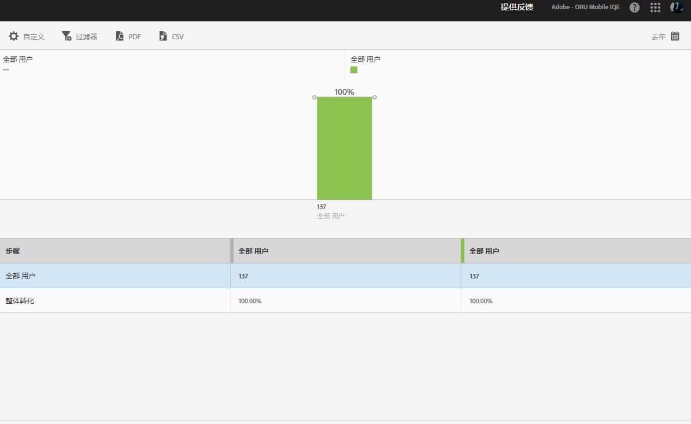

# “漏斗”报表{#funnel}

{#eol}

**[!UICONTROL 漏斗]**&#x200B;报表可帮助确定客户在与您的移动设备应用程序进行交互时，在哪里放弃了营销活动或偏离了定义的转化路径。您还可以使用&#x200B;**[!UICONTROL 漏斗]**&#x200B;报表来比较不同区段的操作。

监视每个步骤的客户决策可让您了解客户在哪里受到阻碍，他们倾向于遵循哪条路径，以及客户何时离开您的应用程序。

在打开&#x200B;**[!UICONTROL 漏斗]**&#x200B;报表时，您必须创建一个自定义漏斗。有关更多信息，请参阅[自定义报表](/help/using/usage/reports-customize/reports-customize.md)。

>[!TIP]
>
>要保存您的自定义漏斗，请在配置其设置并运行报表之后保存 URL。您可以共享 URL 或将其保存在文档中。

以下是此报表的示例：

为了演示一个简单的漏斗报表，以下配置设置使用三个漏斗步骤和两个漏斗比较。我们假设演示应用程序允许用户添加项目（例如照片），然后将其共享。

在“自定义”窗口中，提供了一些部分来指示用户已启动应用程序、从应用程序的图片库中添加照片、从应用程序中在社交媒体、短信、电子邮件上共享了一张或多张照片等。漏斗比较让您能够对比 iOS 应用程序用户与 Android 应用程序用户之间添加和共享照片的级别。

要生成报表，请单击&#x200B;**[!UICONTROL 运行]**。

以下是所生成报表的示例：

第一个系列显示 100% 的用户启动了该应用程序。第二个系列显示，较高百分比的 Android 用户从图片库添加了照片。第三个系列显示，将近一半的 iOS 用户共享了照片，但 Android 用户都未共享过照片。这可能表明应用程序存在需要调查的问题。

要显示其他信息，请将鼠标悬停在条形图的任意条上。

您可以为此报表配置以下选项：

* **[!UICONTROL 时间段]**

   单击&#x200B;**[!UICONTROL 日历]**&#x200B;图标可选择自定义时间段，或从下拉列表中选取预设时间段。
* **[!UICONTROL 自定义]**

   通过更改&#x200B;**[!UICONTROL 显示方式]**&#x200B;选项、添加量度和过滤器，以及添加其他系列（量度）等自定义您的报表。有关更多信息，请参阅[自定义报表](/help/using/usage/reports-customize/reports-customize.md)。
* **[!UICONTROL 过滤器]**

   单击&#x200B;**[!UICONTROL 过滤器]**&#x200B;可创建跨不同报表的过滤器，以便查看区段在所有移动设备报表中的执行情况。置顶过滤器允许您定义应用于所有非路径报表的过滤器。有关更多信息，请参阅[添加置顶过滤器](/help/using/usage/reports-customize/t-sticky-filter.md)。
* **[!UICONTROL 下载]**

   单击 **[!UICONTROL PDF]** 或 **[!UICONTROL CSV]** 可下载或打开文档，并与无法访问 Mobile Services 的用户共享，或者在演示文稿中使用该文件。
