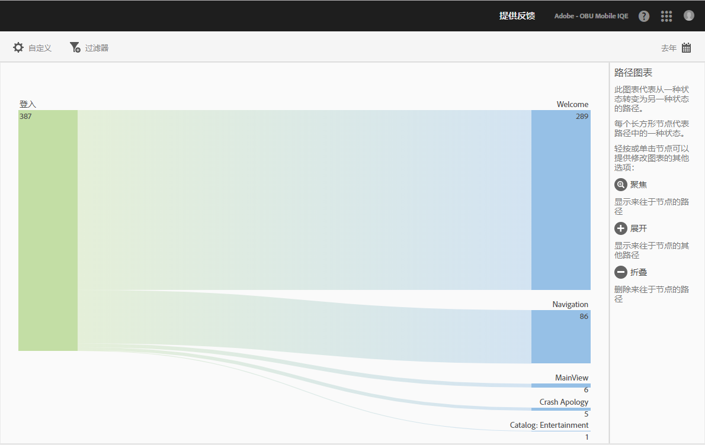
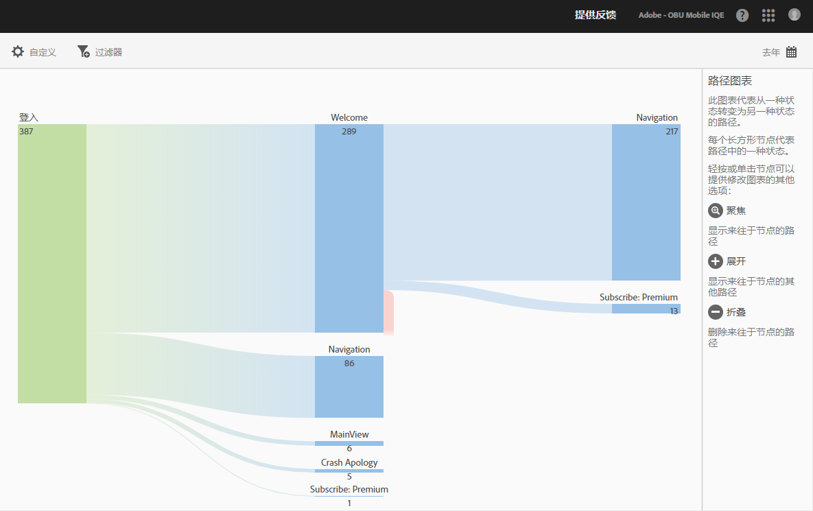
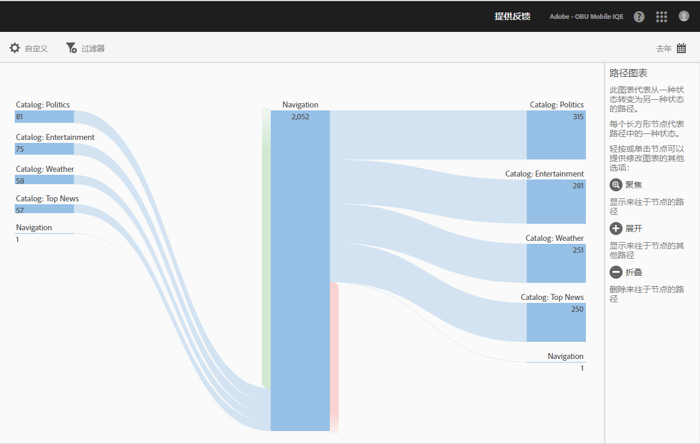

# 查看路径报告 {#view-paths}

**[!UICONTROL 查看路径]报表以路径分析为基础，可显示一个路径图表，以表示应用程序中不同状态之间的路径。**

>[!TIP]
>
>**[!UICONTROL “查看路径]** ”和 **[!UICONTROL “查看操作]** ”报告类似，因为两者都是路径报告。**[!UICONTROL 查看路径]报表允许您查看用户在您的应用程序中如何从一个屏幕导航到下一屏幕。****[!UICONTROL 查看操作]报表可显示用户在您的应用程序中执行操作或事件（例如单击、选择、调整大小等等）的序列。**&#x200B;您可以使用漏斗报表将导航和操作合并到一个报告中。有关更多信息，请参阅 [漏斗](/help/using/usage/reports-funnel.md)。

每个形状类似于框的节点都表示用户路径通过应用程序时的一种状态。例如，在以上插图中，顶级节点表示启动应用程序然后导航至主视图的用户数量。

在单击某个节点以提供更多可用于修改图表的选项后，即会显示诸如&#x200B;**[!UICONTROL 集中]**&#x200B;或&#x200B;**展开]等更多选项。[!UICONTROL **&#x200B;例如，在您单击顶级节点中的 **[!UICONTROL MainView]** 状态之后，即会显示&#x200B;**[!UICONTROL 集中]和**&#x200B;展开]图标。**[!UICONTROL **

To expand the view, click the **[!UICONTROL +]** icon to display the additional paths that come in to or go from the node. 在下面的插图中，状态 1 表示启动应用程序，状态 2 表示查看应用程序的主页，而状态 3 包含用户采用的以下路径：

* 导航到相机胶卷
* 导航到项目选择器
* 导航到相机
* 导航到项目信息页面

Click  to isolate the node and to show the paths that are coming into and going out of the selected node. 在下面的插图中，以下路径是在用户查看应用程序主视图之前完成的：

* 项目信息
* 项目选择器
* 相机胶卷
* 相机

您可以集中或展开多个节点，以详细了解用户在您的应用程序内所采用的路径。例如：

您可以为此报表配置以下选项：

* **[!UICONTROL 时间段]**&#x200B;单击 **[!UICONTROL 日历]** 图标以选择自定义时间段，或从下拉列表中选择预设时间段。
* **[!UICONTROL 自定义]**&#x200B;报表，通过更改 **[!UICONTROL “显示依据]** ”选项、添加指标和过滤器以及添加其他系列(指标)等方式自定义报表。For more information, see [Customize Reports](/help/using/usage/reports-customize/reports-customize.md).
* **[!UICONTROL 过滤]**&#x200B;单击 **[!UICONTROL 过滤器]** 以创建跨越不同报告的过滤器，以查看区段在所有移动报告中的表现。置顶过滤器允许您定义应用于所有非路径报表的过滤器。有关更多信息，请参阅 [添加粘性滤镜](/help/using/usage/reports-customize/t-sticky-filter.md)。
* **[!UICONTROL 下载]**&#x200B;单击 **[!UICONTROL PDF]** 或 **[!UICONTROL CSV]** 以下载或打开文档，并与无权访问Mobile
Services或在演示文稿中使用文件的用户共享。